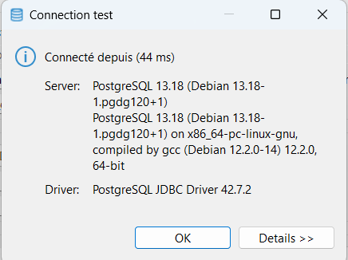

# Projet final Virtualisation & Containeurisation

## Prérequis pour exécuter le projet :

- Installez l'application **DBeaver** en cliquant [**ICI**](https://dbeaver.io/files/dbeaver-ce-latest-x86_64-setup.exe).

- Assurez vous d'avoir bien installé Git et Docker sur votre machine.

## Étapes pour exécuter le projet :

- Dans un terminal de commande, une fois dans un dossier vierge, entrez la commande
```bash
git clone git@gitlab.esiea.fr:vithusan/projet-final-virtu.git
```

- Dans l'application Docker, une fois dans le dossier ou vous avez cloné le projet, entrez la commande 
```bash
docker-compose up
```

- Une fois que le docker a fini de build, allez sur le lien : http://localhost:3000/

### Accéder à la base de donné via DBeaver :

- Lancez l'application DBeaver, puis creer une nouvelle connexion en complétant les cases comme ci-dessous (password = password):


- Testez la connexion avec la base de donnée. Si vous recevez un message comme ci-dessous, le test a fonctionner.



- Cliquez sur "**Finish**", et vous pourrez enfin voir les infomations de la base de donnée.


## Liste des endpoints de l'API : 

- GET
- POST
- DELETE

## Fonctionnalités de l'interface utilisateur :

- Ajouter un élément dans la liste
- Supprimer un élément de la liste


## Vue du site web : 

